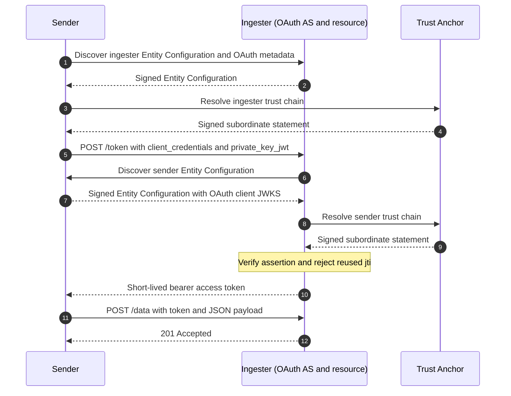

# Federated OAuth 2.0 server-to-server demo

This example transfers JSON from a sender service to an ingester using OAuth 2.0
`client_credentials` and `private_key_jwt`. The ingester discovers and trusts the
sender through OpenID Federation; it does not keep an OAuth client registry or
require the sender to register at its token endpoint.

With `DEV_MOCK_AUTH=true`, the ingester hosts a fixture Trust Anchor and adds
both demo entities as federation members. The OAuth flow still uses signed
client assertions and access tokens; only the federation anchor is local.
Set `DEV_MOCK_AUTH=false` to validate against a real Trust Anchor configured
through environment variables.

The local entities use `ta.s2s.dev.localhost`, `ingester.s2s.dev.localhost`,
and `sender.s2s.dev.localhost` on port `8443`. Caddy routes the sender domain
to the sender service and the other two domains to the ingester and embedded
Trust Anchor.

## How it works

The demo's `POST /send` endpoint triggers this sender-to-ingester exchange:



## Bare-metal setup

Requires Node.js 22.12 or later and [Caddy](https://caddyserver.com/docs/install).
Run these commands from this directory:

```sh
npm install
cp .env.dist .env
npm run setup
```

`npm run setup` creates signing keys under `.keys/`. Do not commit these keys
or reuse them outside this example.
If you already have an older `.env`, update its entity IDs to the values in
`.env.dist`.

### Use a real Trust Anchor

Set `DEV_MOCK_AUTH=false` in `.env` and configure either one Trust Anchor:

```dotenv
TRUST_ANCHOR_ENTITY_ID=https://federation.example.org
TRUST_ANCHOR_JWKS={"keys":[{"kty":"EC","crv":"P-256","alg":"ES256","use":"sig","kid":"...","x":"...","y":"..."}]}
```

Or set `TRUST_ANCHORS_JSON` to a non-empty JSON array of `{ "entityId",
"jwks" }` objects. Also set `INGESTER_ENTITY_ID` and `SENDER_ENTITY_ID` to
their public HTTPS entity IDs. After `npm run setup`, arrange for the real
Trust Anchor to recognize each entity and its federation public key from
`.keys/ingester.json` and `.keys/sender.json`. Federation membership is still
required; neither entity is directly registered at the OAuth token endpoint.
The bundled Caddy configuration is for the local fixture only. In real mode,
publish the entity IDs through a production HTTPS reverse proxy.

## Bare-metal run

For the default `DEV_MOCK_AUTH=true` mode, open three terminals in this
directory and start the local HTTPS proxy:

```sh
caddy run --config Caddyfile
```

Before starting either Node service, configure Node to trust Caddy's local CA.
On macOS:

```sh
export NODE_EXTRA_CA_CERTS="$HOME/Library/Application Support/Caddy/pki/authorities/local/root.crt"
```

On Linux, use the Caddy data directory:

```sh
export NODE_EXTRA_CA_CERTS="${XDG_DATA_HOME:-$HOME/.local/share}/caddy/pki/authorities/local/root.crt"
```

Then start the services in the other terminals:

```sh
npm run ingester
```

```sh
npm run sender
```

Ask the sender to transfer a sample JSON object:

```sh
curl --cacert "$NODE_EXTRA_CA_CERTS" \
  -X POST https://sender.s2s.dev.localhost:8443/send \
  -H 'content-type: application/json' \
  -d '{"message":"hello federation"}'
```

The sender discovers the ingester, creates a signed client assertion, obtains a
short-lived access token, and posts the JSON to the protected ingest endpoint.
The response shows the accepted record. Each service can be stopped with
Ctrl+C.

With `DEV_MOCK_AUTH=false`, do not use the bundled local Caddy configuration
or its local CA certificate. Route the configured public entity IDs to the
ingester and sender services with your HTTPS reverse proxy instead.

## Docker setup and run

Requires Docker Compose v2 and a running Docker daemon. From the repository
root, build the shared image, create its demo signing keys on first run, and
start Caddy, the ingester, and the sender together. This shared-container
workflow defaults to `DEV_MOCK_AUTH=true`; `make` creates `.env` from
`.env.dist` if it does not exist.

```sh
make build-image-javascript-oauth-s2s-example
make setup-image-javascript-oauth-s2s-example # first run only
make run-image-javascript-oauth-s2s-example
```

In another terminal, copy the demo CA certificate out of the container and send
a sample payload in `DEV_MOCK_AUTH=true` mode. Run this from any directory
inside the repository:

```sh
cd "$(git rev-parse --show-toplevel)"
docker compose -f javascript-oauth-s2s-example/docker-compose.yml cp \
  s2s-demo:/data/caddy/pki/authorities/local/root.crt \
  javascript-oauth-s2s-example/.caddy-root.crt
curl --cacert javascript-oauth-s2s-example/.caddy-root.crt \
  -X POST https://sender.s2s.dev.localhost:8443/send \
  -H 'content-type: application/json' \
  -d '{"message":"hello from the shared container"}'
```

Or send the same request from inside the shared container without copying the
CA certificate to the host:

```sh
cd "$(git rev-parse --show-toplevel)"
docker compose -f javascript-oauth-s2s-example/docker-compose.yml exec \
  -e NODE_EXTRA_CA_CERTS=/data/caddy/pki/authorities/local/root.crt \
  s2s-demo node --input-type=module -e '
    const response = await fetch("https://sender.s2s.dev.localhost:8443/send", {
      method: "POST",
      headers: { "content-type": "application/json" },
      body: JSON.stringify({ message: "hello federation" })
    });
    console.log(await response.text());
    if (!response.ok) process.exitCode = 1;
  '
```

For `DEV_MOCK_AUTH=false`, configure `.env` with the real Trust Anchor and
public entity IDs before building or starting. The container skips its local
Caddy fixture and exposes the service ports on loopback (`4101` for the
ingester and `4102` for the sender); route the public HTTPS entity IDs to those
ports with an external reverse proxy.

Stop the shared container with Ctrl+C in the `make run-image-...` terminal or
run `make stop-image-javascript-oauth-s2s-example`.

## Tests

```sh
npm test
```
